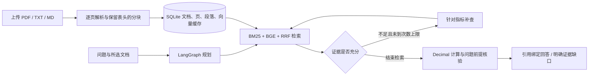

# 中文年报证据分析工作台

本功能基于 `kkkano/FinSight` 二次开发，入口 `/annual-reports`，集中展示上传资料的检索与核验能力。原 FinSight 的行情、投资研究和聊天流程保留。

## 本 fork 实现范围

2026-09-12：GitHub fork 已创建为 `Wyyyyuu/FinSight`；本地开发分支 `feature/annual-report-workbench`。
已实现以下能力，独立入口和主 API 共用同一个年报模块：

- PDF/TXT/Markdown 上传、逐页解析、SQLite 持久化与重复文件去重。
- 严格所选文档范围下的中文 BM25、真实中文语义向量与 RRF 混合召回。
- LangGraph 规划、检索、证据检查、有限补查、确定性计算、来源绑定回答。
- 前端上传、选择、分析、停止等待、证据原文查看和窄屏布局。
- 合成样例、真实中文年报解析与语义检索验证，以及独立 CI。



## 独立运行

Python 3.11+、Node.js 20+。无需行情 API、数据库服务或 LLM 密钥即可完成证据摘录与数值计算。

```powershell
python -m venv .venv
.\.venv\Scripts\python.exe -m pip install -r requirements-annual.txt
npm ci --prefix frontend
$env:VITE_ANNUAL_REPORT_API_BASE_URL='.'
npm run build --prefix frontend
.\scripts\start-annual-reports.ps1
```

打开 <http://127.0.0.1:8001/annual-reports>。独立服务绑定本机，直接复用主 API 的年报 router；不会启动原平台行情调度器。前端构建时 `VITE_ANNUAL_REPORT_API_BASE_URL='.'` 表示年报 API 与网页同源，其他已有模块的 API 配置不变。

也可安装原项目 `requirements.txt` 后运行 `backend.api.main:app`，年报 API 已注册到同一主服务。远程访问必须接入原项目的已验证身份机制，工作区按用户分开；请求中的文档 ID 或会话 ID不能跨用户访问资料。无身份模式仅限本机访问。

## 真实语义检索

默认 BM25 模式无需模型下载。启用语义检索需要真实 `BAAI/bge-small-zh-v1.5` ONNX 模型；不使用哈希向量冒充语义向量。

```powershell
$env:ANNUAL_REPORT_MODEL_CACHE = Join-Path (Get-Location) '.annual-models'
.\.venv\Scripts\python.exe scripts/warm_annual_embeddings.py
.\scripts\start-annual-reports.ps1 -Semantic
```

模型不可用时会显式标记关键词回退，不能将其当作混合检索的测评结果。`/api/annual-reports/health` 返回模型是否实际加载及回退原因。模型缓存、上传文件和数据库已在 `.gitignore` 排除。

首次查询会计算并缓存所选报告的真实向量；长年报可能需要数分钟。向量默认按 8 条一批推理，`ANNUAL_REPORT_EMBEDDING_BATCH_SIZE` 可设为 1–32，CPU 线程默认 2。后续查询复用 SQLite 中的向量。无服务端任务队列；页面“停止等待”只中止浏览器请求，已开始的后台解析或索引可能继续完成。

## 模型辅助回答（可选）

同时设置 `ANNUAL_REPORT_LLM_BASE_URL`、`ANNUAL_REPORT_LLM_API_KEY`、`ANNUAL_REPORT_LLM_MODEL` 才调用兼容 Chat Completions API。未配置时使用“证据摘录”。回答的金额计算始终由 Decimal 完成，模型只选择来源中的原文片段；不在来源中的引文、伪造引用和模型错误会触发回退。密钥只放本机环境变量，不写入代码、浏览器或版本库。

## 使用与边界

1. 上传年报并填写公司与报告年度；选择本次允许检索的资料。
2. 输入问题，例如“比较 2023 年和 2024 年营业收入与经营现金流变化”。
3. 查看证据充分性、计算公式及对应来源；点来源打开物理 PDF 页文本。

页码为 PDF 物理页（从 1 开始），可能与印刷页码不同。TXT/Markdown 使用换页符分隔页面。扫描件需先 OCR；系统不会假装识别成功。复杂调整前/调整后表头、跨币种和缺少明确单位的数字保守拒算。当前确定性金额抽取支持营业收入、经营现金流净额、归母净利润三类指标，其他内容提供检索摘录。

上传年度是报告元数据，不代表每个数字都属于该年度。问题中的年份用于定位财务事实，允许从所选 2024 年报的明确比较列读取 2023 年数据；显式 API `years` 始终限制可检索报告的元数据年度。原因说明也核对公司和年度，不能拿其他年度的原因替代。所有补查保持所选文档集合不变，最多两次。

“加载示例”使用明确标注的虚构公司和合成数据，便于测试交互，不是实际财报或模型能力基准。真实测评必须使用独立标注的问题、来源页和正确值；测试通过不能直接转化为简历中的业务准确率。

## API

| 请求 | 用途 |
|---|---|
| `GET /api/annual-reports/health` | 工作区与模型配置状态 |
| `GET /api/annual-reports/documents` | 当前工作区资料 |
| `POST /api/annual-reports/documents` | Multipart：file、company、year |
| `GET /api/annual-reports/documents/{id}/pages/{page}` | 来源原文页 |
| `POST /api/annual-reports/demo` | 幂等导入合成示例 |
| `POST /api/annual-reports/analyze` | 问题、所选文档、可选年份与有界补查 |

## 验证

```powershell
.\.venv\Scripts\python.exe -m pip install pytest-cov ruff
.\.venv\Scripts\python.exe -m pytest tests/annual_reports -q --basetemp=data/annual_reports/test-tmp --cov=backend.annual_reports --cov=backend.api.annual_report_router --cov-report=term-missing --cov-fail-under=80
.\.venv\Scripts\python.exe -m ruff check backend/annual_reports backend/api/annual_report_router.py tests/annual_reports
npm run lint --prefix frontend
npm run test:unit --prefix frontend
npm run build --prefix frontend
npm run test:e2e --prefix frontend
```

PDF 单测需要 `reportlab`（主项目依赖已包含）；全新独立环境可执行 `pip install reportlab`。首次运行浏览器测试前，在 `frontend` 目录执行 `npx playwright install chromium`。

实际验证记录（Windows、Python 3.12，2026-09-12）：

| 验证 | 结果 |
|---|---|
| 年报模块与 API 自动测试 | 137 项通过，覆盖率约 94%，CI 下限 80% |
| 原核心请求理解、策略、回复契约与认证回归 | 95 项通过 |
| 新增主 API 认证与用户隔离集成测试 | 4 项通过 |
| 上游 `backend/tests` 全量 GitHub 回归 | 1841 通过、19 失败、8 跳过；19 项均在未改上游后端复现，原因见下 |
| 前端单测 | 36 个文件，217 项通过 |
| 前端浏览器回归 | 42 项通过；最终文案调整后额外复跑年报 5 项通过 |
| Ruff / 前端 ESLint / 生产构建 | 通过；ESLint 有 3 条上游既有 warning，无 error |
| 浏览器连接真实独立后端 | 跨年计算、混合检索、来源原文弹窗验证通过 |
| 真实 PDF 与 BGE | 美的 2024 年报 295 页、1550 块；真实 512 维向量，非关键词回退 |
| 真实年报验收脚本 | BM25 与 hybrid 分别 3/3 用例、46/46 断言通过；hybrid 发生关键词回退即判失败 |

上游两项策略测试曾在依赖未安装完整时失败，补齐原项目数据工具依赖后，上述 95 项全部通过。未测试外部行情服务或有密钥的生成模型。

新增[年报工作台 GitHub CI](https://github.com/Wyyyyuu/FinSight/actions/runs/34678057087)已在 Linux 通过后端覆盖率门槛、前端单测、构建和浏览器测试。首轮整库 CI 在安装上游 `litellm==1.30.0` 时失败；当前代码无该库引用且本功能无需它，已移除这项失效依赖。

清理后[整库 CI](https://github.com/Wyyyyuu/FinSight/actions/runs/34678169412)成功安装依赖并执行 `backend/tests`：1841 通过、19 失败、8 跳过。19 个失败分布在 `test_langgraph_api_stub.py`、`test_phase5_no_double_routing.py`、`test_streaming_datetime_serialization.py`、`test_trace_and_session_security.py`，均为旧聊天端点在未配置 LLM 时先返回 503。相同四个文件在未修改后端的上游隔离检出中复现 19 失败、9 通过，确认不是年报改动引入。新年报独立入口的无密钥模式已单独验证通过。

### 可重复的真实年报验收

从[美的官方 2024 年度报告](https://www.midea.com.cn/content/dam/mideacn-aem/%E6%8A%95%E8%B5%84%E8%80%85%E5%85%B3%E7%B3%BB/%E6%8A%95%E8%B5%84%E8%80%85%E5%85%B3%E7%B3%BB%E6%96%87%E4%BB%B6%E6%80%BB%E8%A7%88/2024%E6%96%87%E4%BB%B6/%E7%BE%8E%E7%9A%84%E9%9B%A2-2024%E5%B9%B4%E5%B9%B4%E5%BA%A6%E6%8A%A5%E5%91%8A.PDF.coredownload.inline.pdf)下载 PDF，传给验收脚本。报告没有提交到 Git。

```powershell
.\.venv\Scripts\python.exe scripts/verify_annual_midea_2024.py --pdf 'C:\reports\midea-2024.pdf' --mode bm25
$env:ANNUAL_REPORT_MODEL_CACHE = Join-Path (Get-Location) '.annual-models'
.\.venv\Scripts\python.exe scripts/verify_annual_midea_2024.py --pdf 'C:\reports\midea-2024.pdf' --mode hybrid
```

脚本运行真实解析、检索、LangGraph 和计算；关闭生成模型调用及模型自动下载。输出到 `data/annual_reports/verification/midea_2024_smoke_result.json`，包含 PDF SHA256、每题状态、引用、耗时与逐项断言，失败返回非零退出码。

核验对象是物理第 9 页的原始财务表：2022–2024 年营收分别为 343,917,531,000 / 372,037,280,000 / 407,149,600,000 元；经营现金流分别为 34,657,828,000 / 57,902,611,000 / 60,511,572,000 元。四项同比应为 8.18%、9.44%、67.07%、4.51%。另验证从新报告读取旧年比较列，以及纠正“2024 年现金流下降”的错误前提。

本机真实 HTTP 混合分析首次约 170 秒（包含整本报告建索引）；缓存后错误前提问题约 3.02 秒。最终脚本在缓存已有向量时，三个 hybrid 用例分别约 2.20 / 0.86 / 3.64 秒。耗时受硬件、报告、并行负载影响。这是单份报告的三个冒烟用例，不是泛化准确率，也不能作为线上业务指标。

## 作为项目经历时的准确范围

可描述为“基于开源 FinSight 二次开发中文年报证据分析工作台，实现中文混合检索、LangGraph 有界补查、财务表年度绑定、确定性计算与引用溯源”。差异点集中在文档 RAG 和数据核验，可与代码评审/修复型 Agent 项目形成互补；原平台的行情、图表和研究 Agent 应明确归于上游基础。

主要实现文件：`backend/annual_reports/`、`backend/api/annual_report_router.py`、`frontend/src/pages/AnnualReportsPage.tsx`。默认 SQLite 与应用进程内检索适合本机项目演示，尚无分布式索引、OCR、后台任务取消和大规模并发保证。
